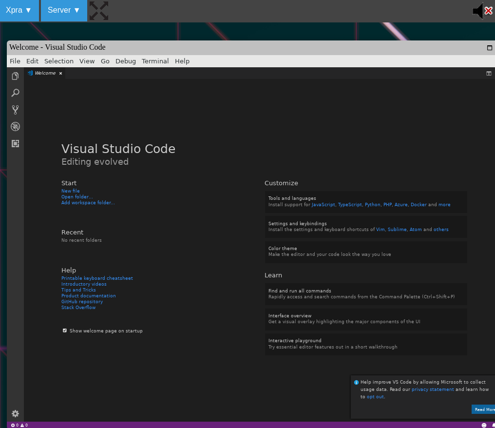

# xpra-cloud-apps
A sandbox configuration for running apps inside a browser window using XPRA.

## Introduction

This is a quick test of [XPRA](https://xpra.org) for the following application:

* VSCODE
* ANDROID STUDIO/IntelliJ

Mainly I wanted to be able to run these apps from the Cloud rather than my Pixelbook so I use docker and X11 to achieve that. However, there was a requirement to run apps within the browser. XPRA works really well and means I dont have to use a VNC plugin.

If you use a remote host - then replace localhost with the external IP address and the port with whatever works for you. Tested on Google Cloud Platform and access is both fast and smooth.

## Dockerfile Configuration

Reference: Dockerfile

* Base image: debian:stretch-slim
* EXPOSE: 10000
* VOLUME  /data
* WORKDIR /data
* USER    user
* PORT    8080:10000

## How to Run

1. Download the repository
2. Run the docker build script command to generate an image e.g. 

	bash docker-build.sh
	
3. Run the container script command to run the XPRA container e.g. 

	bash docker-run.sh 

4. Access the application from your browser on the port specified e.g. 

	localhost:8080

